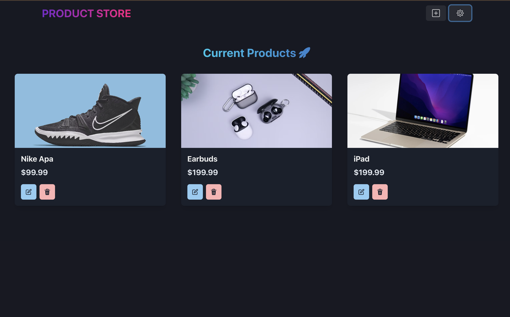
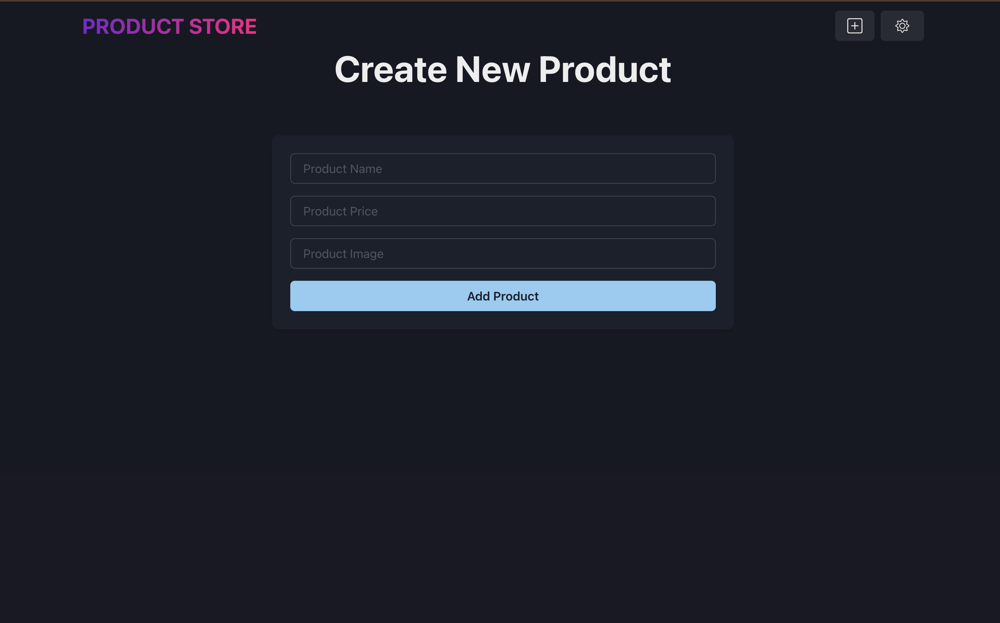

# Product-App 🛒

A **full-stack** web application built using the **MERN stack** (MongoDB, Express.js, React, Node.js) that allows users to **create, view, update, and delete (CRUD)** product listings. The app provides a simple and intuitive UI for managing products efficiently.

## 🌟 Features
- 🏪 **Product Listing** – Displays all available products with their name, price, and image.
- ➕ **Add New Product** – Users can add a new product by providing the name, price, and image URL.
- ✏️ **Edit Product** – Allows users to update product details.
- 🗑️ **Delete Product** – Users can remove products from the list.
- 🎨 **Responsive UI** – Built with **Chakra UI** for a clean and modern design.
- ⚡ **Optimized with Vite** – Fast development and build time for an improved user experience.
- 🌑 **Dark Mode Toggle** – Easily switch between light and dark themes.

## 🛠️ Tech Stack
- **Front-end:** React, Chakra UI, Vite  
- **Back-end:** Node.js, Express.js  
- **Database:** MongoDB  
- **Deployment:** Render  

## 🚀 Live Demo
🔗 **Try the app here:** [Product-App](https://product-app-sbpb.onrender.com/)

## 📸 Screenshots
### Home Page – View All Products


### Create New Product Page


## 📦 Installation & Setup
To run the project locally, follow these steps:

### 1️⃣ Clone the repository
```sh
git clone https://github.com/janiussyafiq/product-app.git
cd product-app
npm run build
npm run start
